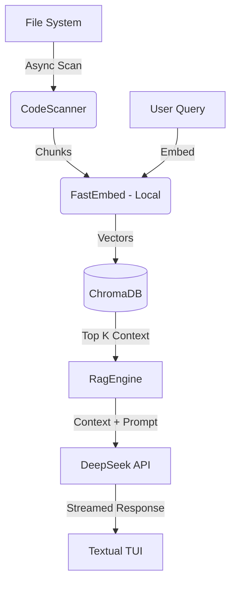

# 👻 CodeSoul - The Codebase Spirit Medium

> **"Vibe Coding" at its finest.**  
> Turn your codebase into a living, breathing persona you can chat with in your terminal.

 

## 🤔 What is this?

**CodeSoul** is a RAG (Retrieval-Augmented Generation) powered Terminal User Interface (TUI) that indexes your source code and generates a "Soul" (Persona) based on its statistics.

*   **Hybrid RAG**: Uses **FastEmbed** (local CPU embedding) + **ChromaDB** (local vector store) + **DeepSeek** (Cloud LLM).
*   **Persona Generation**: Your spaghetti code might manifest as a "Grumpy Legacy Wizard", while your clean clean architecture might be a "Zen Monk".
*   **Interactive TUI**: Built with `Textual`, featuring real-time chat, file exploration, and syntax highlighting.

## 🚀 Quick Start

### Installation

**The best way to use CodeSoul is to install it as a global tool with `uv`:**

```bash
# Install globally
uv tool install .

# Run from anywhere
codesoul /path/to/any/project
```

### Development Setup

If you want to contribute or modify the code:

1.  **Clone the repo**
    ```bash
    git clone https://github.com/zylar06/codesoul.git
    cd codesoul
    ```

2.  **Initialize with `uv`**
    ```bash
    uv sync
    ```

3.  **Configure API Key**
    Copy `.env.example` to `.env` and add your DeepSeek API Key.
    ```bash
    cp .env.example .env
    # Edit .env and paste your key
    ```

4.  **Run Locally**
    ```bash
    uv run codesoul .
    ```

## 🏗️ Architecture



## 🛠️ Tech Stack

*   **Manager**: `uv`
*   **Frontend**: `Textual`, `Rich`
*   **Backend**: `AsyncIO`
*   **AI/RAG**: `ChromaDB`, `FastEmbed`, `OpenAI SDK` (for DeepSeek)

## 👻 Vibe Check

Run it on different repos to see different personalities:
*   **Linux Kernel**: Likely an Eldritch Horror.
*   **React**: A chaotic JavaScript hipster.
*   **This Repo**: A self-aware narcissist.

---
*Built for the Vibe Coding Interview.*
