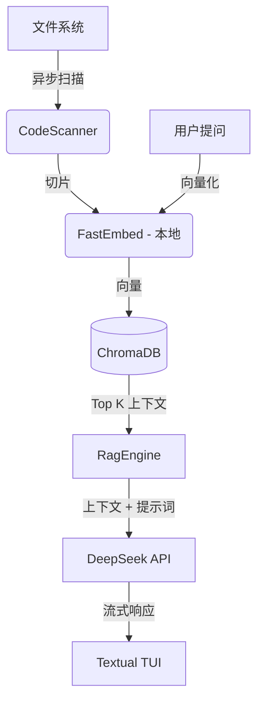

# 👻 CodeSoul - 代码通灵师

> **极致的 "Vibe Coding" 体验。**  
> 将你的代码库变成一个有血有肉、能在终端里与你对话的“灵魂”。

 

[English Docs](README.md)

## 🤔 这是什么？

**CodeSoul** 是一个基于 RAG (检索增强生成) 的终端用户界面 (TUI) 应用。它会索引你的源代码，并根据代码的统计特征（行数、复杂度、注释风格）生成一个独特的“灵魂”（人格）。

*   **混合 RAG 架构**: 使用 **FastEmbed** (本地 CPU 向量化) + **ChromaDB** (本地向量库) + **DeepSeek** (云端大模型)。隐私与性能兼得。
*   **人格生成**: 你的面条代码可能会化身为一个“暴躁的遗留系统巫师”，而整洁的架构则可能变成一个“极简主义修道士”。
*   **交互式 TUI**: 基于 `Textual` 构建，拥有炫酷的文件树、实时聊天流和语法高亮。

## 🚀 快速开始

### 安装指南

**推荐使用 `uv` 将其安装为全局工具：**

```bash
# 全局安装
uv tool install .

# 在任何地方运行
codesoul /path/to/any/project
```

### 开发环境配置

如果你想修改代码或参与贡献：

1.  **克隆仓库**
    ```bash
    git clone https://github.com/zylar06/codesoul.git
    cd codesoul
    ```

2.  **使用 `uv` 初始化**
    ```bash
    uv sync
    ```

3.  **配置 API Key**
    复制 `.env.example` 到 `.env` 并填入你的 DeepSeek API Key。
    ```bash
    cp .env.example .env
    # 编辑 .env 文件
    ```

4.  **本地运行**
    ```bash
    uv run codesoul .
    ```

## 🏗️ 架构设计



## 🛠️ 技术栈

*   **包管理**: `uv` (极速 Python 包管理器)
*   **前端 UI**: `Textual`, `Rich`
*   **后端**: `AsyncIO`
*   **AI/RAG**: `ChromaDB`, `FastEmbed`, `OpenAI SDK` (适配 DeepSeek)

## 👻 Vibe Check (气质检测)

试试在不同的仓库运行它，看看会召唤出什么：
*   **Linux Kernel**: 可能会是一个不可名状的古神 (Eldritch Horror)。
*   **React**: 一个混乱中立的 JavaScript 嬉皮士。
*   **本项目**: 一个自恋的 AI 助手。

---
*Built for the Vibe Coding Interview.*
